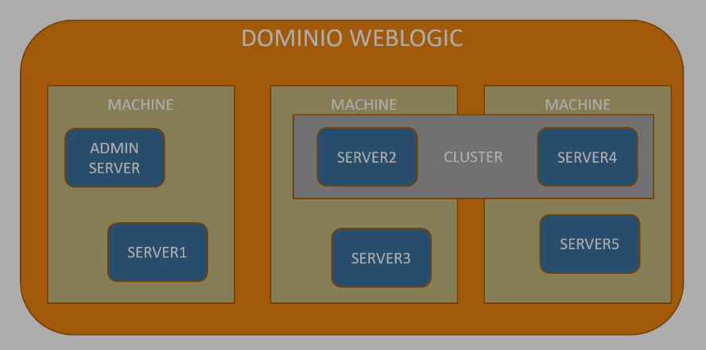

# Oracle Weblogic desde Cero 
### by Apasoft Training, Udemy

This course prepares for exam am 1Z0-133, **Oracle WebLogic Server 12c: Administration I**

## Introduction 
Weblogic is an application server for enterprise Java applications. It is a Java EE compliant server (a standard). Java EE include specifications such as JDBC, JMS, JMX etc. Other application servers in the same category are IBM Webshpere, Jboss etc. 

Java EE servers _run_ over _one_ JVM (only one ?), which will include, other than the standard JVM libraries, all the libraries in the Java EE specification (some version). Java EE servers will _implement_ those specifications, but may add  some vendor-specific libraries as well. See the Java EE 8 specs below. Weblogic 12c is compatible with  Java EE 7. 

Weblogic supports clustering for high availability, fault tolerance, and scalability. 

Weblogic is the engine supporting all, or most, the _Fusion Middleware_ products of Oracle:
- Oracle SOA
- Oracle Business Bus
- Oracle Business Intelligence (BI)
- Oracle BPM
- Oracle Identity 

etc.

Java EE servers receive request from Java or the web, for example. Any Java EE server will have two big layers. One is the _web layer_ (presentation layer) which will include HTML, CSS, JSP, Servlets etc. This layer runs the web part of the applications. The second layer is the _business layer_, which includes  EJB etc. The objects in the business layer contain the business logic and are invoked by the presentation layer. **Tomcat** is not a Java EE compliant server, as it can natively run only a web layer.

Enterprise application need to access external resources such as databases, web services, Crms, Erps etc.

## Java EE 8
#### https://www.oracle.com/it/java/technologies/java-ee-glance.html
Java EE 8 continues to improve API and programming models needed for today's applications and adds features requested by our world-wide community. This release modernizes support for many industry standards and continues simplification of enterprise ready APIs. Enhancements include:

- Java Servlet 4.0 API with HTTP/2 support
- Enhanced JSON support including a new JSON binding API
- A new REST Reactive Client API
- Asynchronous CDI Events
- A new portable Security API
- Server-Sent Events support (Client & Server-side)
- Support for Java SE 8 new capabilities (e.g. Date & Time API, Streams API, annotations enhancements)

Java EE 8 builds on Java EE 7. The following JSRs are new or updated in Java EE 8:
- JSR 366 – Java EE 8 Platform
- JSR 365 – Contexts and Dependency Injection (CDI) 2.0
- JSR 367 – The Java API for JSON Binding (JSON-B) 1.0
- JSR 369 – Java Servlet 4.0
- JSR 370 – Java API for RESTful Web Services (JAX-RS) 2.1
- JSR 372 – JavaServer Faces (JSF) 2.3
- JSR 374 – Java API for JSON Processing (JSON-P)1.1
- JSR 375 – Java EE Security API 1.0
- JSR 380 – Bean Validation 2.0
- JSR 250 – Common Annotations 1.3
- JSR 338 – Java Persistence 2.2
- JSR 356 – Java API for WebSocket 1.1
- JSR 919 – JavaMail 1.6

## Weblogic architecture
wl has wl Domains, which is a logical name. A wl **domain** is a set of wl servers. Each wl server will run in an independent JVM. wl servers in a same domain will have common access a set of resources, and Java applications. They are servers that collaborate, and are administrated together. They may run Java applications.

Each wl domain will have one, and only one, **Admin Server**. In production environment, its sole purpose should be running Weblogic Administration Console (web console?). There is also a cli administration console, WLST. In development environment however, it is common to run applications in the Admin Server as well.

The Admin Server manages **managed servers** in its domain. The managed servers are the servers running the applications. Managed servers can be grouped in **clusters**. Servers in a cluster will contain the same applications, will have access to the same resources, same behaviour etc (high availability cluster).

Each wl domain will also have **machines**. A machine is also logical concept, but they do are _associated_ with physical, or virtual, machines. All wl servers in a domain, including the Admin Server, will be running "inside" a given machine. A cluster of managed servers may include servers running in different machines.

We take real or virtual machines, and assign to them, first, machines, and then, wl servers.

Inside a wl domain we can create a **cluster**



## Installation of Oracle Fusion Middleware
In order to install Oracle Fusion Middleware you have to download the installer first from your Oracle account. I downloaded `fmw_12.2.1.4.0_infrastructure.jar`. It is then installed with `java -jar fmw_12.2.1.4.0_infrastructure.jar`. The active JDK most be one from Oracle. The installation directory I chose is (_Oracle home_):
```text
~/Oracle/Middleware/Oracle_Home$ ll
total 40
drwxr-x---  9 camilo camilo 4096 dic 30 13:32 ./
drwxr-x---  3 camilo camilo 4096 dic 30 13:30 ../
drwxr-x---  6 camilo camilo 4096 dic 30 13:30 coherence/
drwxr-x---  8 camilo camilo 4096 dic 30 13:31 em/
drwxr-x--- 16 camilo camilo 4096 dic 30 13:32 inventory/
drwxr-x--- 11 camilo camilo 4096 dic 30 13:31 OPatch/
drwxr-x--- 18 camilo camilo 4096 dic 30 13:31 oracle_common/
-rw-r-----  1 camilo camilo  129 dic 30 13:32 oraInst.loc
drwxr-x---  8 camilo camilo 4096 dic 30 13:32 oui/
drwxr-x---  8 camilo camilo 4096 dic 30 13:31 wlserver/
```
Inside this directory we might later install other products from the Oracle Middleware suite. Directories here are:
- coherence/: files of this product from Oracle. Coherence is a grid memory (cluster) used by Oracle for session data storage etc.
- em/: Console of the enterprise manager, including the Enterprise Manager Fusion Control ? From here we can administer all the middleware applications in Oracle Fusion Middleware, eg. Oracle Business Intelligence, Oracle Identity, Oracle Portal etc. Weblogic (the application, one of the products of Oracle Fusion Middleware), though, has its own console.
- inventory/: ever present. Contains components and patches installed in the Oracle home. Historic inventory.
- OPatch/: ever present. Contains binaries and libraries to do patches. 
- **oracle_common/**: programs and libraries common to wl server. Important for configurations.
- oui/: files for Oracle Universal (Un)Installer. I used `oui/deinstall.sh` to uninstall Oracle Fusion Middleware 12c and install it again with the correct JDK 1.8.0_191 from Oracle.
- **wlserver/**: This is the _Weblogic home_. Files and everything of Weblogic.Important.
 
### Weblogic Home `wlserver` (WL_HOME)
The most important directories in wlserver/ are:
- common/: scripts and binaries to perform some tasks with wl server
- server/: component libraries etc
- modules/: jars that wl uses, needed by the deployed applications, I think

## Weblogic domain
A domain is a set of wl resources managed as one thing, a common control. This resources may be wl servers, coherence servers, jms, jdbc etc. The directory `~/Oracle/Middleware/Oracle_Home/oracle_common/common/bin$` contains lots of scripts. Some of them are called by scripts in the same directory. To _create domains_ we use the script
```text
~/Oracle/Middleware/Oracle_Home/oracle_common/common/bin/config.sh
```
Notice that this important script for Weblogic is not in the wlserver/ directory. A domain is a logical concept. Thus, its "location" is nothing but the location of its config files and libraries. It is recommended to create our domains separated from the rest of Weblogic components, ie. out of the Oracle home dir. The default location for a newly created domain will be `/home/<user>/Oracle/Middleware/Oracle_Home/user_projects/domains/base_domain`, but we can create it wherever we want.

The script `config_builder.sh` is the other important script, used to create domain templates.

The script `config.sh` is used to create wl domains. By default, it opens a graphical GUI. To run it in console mode pass `-mode=console`. Once we finish the wizard, a directory named after the name of the created domain will appear in `<domain_name>/servers/`. Notice that right after the creation of the domain only the Admin Server will appear here. The managed servers directories will be created once we start the admin server for the first time. 

To update an existing domain is also known as to extend and existing domain. It is also done through script `config.sh`. This is used to add new technologies to an existing domain, or to add new Java EE libraries needed by applications running in the managed servers of the domain ? Notice that when we add a new feature to a domain, we cannot "remove" it after, using the same script `config.sh`. Examples of new features, or Java EE libraries, to be added when we update a domain may be "Weblogic Advanced Web Services for JAX-WS Extension" of "Weblogic JAX-WS SOAP/JMS Extension". Notice that all these libraries can be added when we create the domain initially. 

The Admin server runs the admin (web) console, from where we manage all the components of the domain. The admin console is deployed in the Admin Server; it is the only application the administration server should have. By default, it listens on port 7001.  We can't run the admin console in other server of the domain, other than the admin server.

When we create a _domain_, we can set for it either of the modes:
- Development: Allows autodeploy by simply throwing our artifacts into such directory. Loads wl admin credentials from `boot.properties` file. Thought To ease development. 
- Production: None of the features in Development.

A change in domain mode from Development to Production will require restarting all the servers in the domain. We do this either by clicking "Restart" for each server in the console (works only if the servers have the node manager process running), or shutting down them in the console and starting them again with the start scripts we'll see below.  

The mode of the domain can later be changed, though, from the console.

When we create a domain, me must also select JDK. It seems, therefore, that all the wl servers created for the domain afterwards, will use the same JDK. Also, when we create a domain, we can create its Admins server, the node manager, some managed servers, clusters etc. 

The node manager is used to administer remote wl (managed) server.

We shouldn't edit the domain config files manually (`<domain_name>/config/`). They must be edited only through the graphical or cli consoles. The domain config file is `<domain_name>/config/config.xml`. It doesn't contain every and each configuration of the domain though. It only contains those that have been changed respect to their default values.

### I took "rigorous notes" only until end of video 15 of the course.

We start the Admin server with script, or its domain, with `.../Oracle_Home/user_projects/domains/domain1/startWebLogic.sh`. After we have to start the managed servers. The admin web console runs on the admin server, so we need to start the latter first. Notice that to start a domain with this script, we need to run that one present in the directory of the specific domain.

After we have started a domain we can do 
```text
$ ps -ef|grep bin/java
camilo   1170208 1170170 17 17:49 pts/3    00:00:32 /usr/lib/jvm/jdk1.8.0_191/bin/java -server -Xms256m -Xmx512m -XX:CompileThreshold=8000 -cp /home/camilo/Oracle/Middleware/Oracle_Home/wlserver/server/lib/weblogic-launcher.jar -Dlaunch.use.env.classpath=true -Dweblogic.Name=AdminServer -Djava.security.policy=/home/camilo/Oracle/Middleware/Oracle_Home/wlserver/server/lib/weblogic.policy -Djava.system.class.loader=com.oracle.classloader.weblogic.LaunchClassLoader -javaagent:/home/camilo/Oracle/Middleware/Oracle_Home/wlserver/server/lib/debugpatch-agent.jar -da -Dwls.home=/home/camilo/Oracle/Middleware/Oracle_Home/wlserver/server -Dweblogic.home=/home/camilo/Oracle/Middleware/Oracle_Home/wlserver/server weblogic.Server
camilo   1170510 1148119  0 17:52 pts/2    00:00:00 grep --color=auto bin/java
```
This shows that the wl server will be nothing but a Java process running on a JVM with some properties. This command shows that we are running a Java class called `weblogic.Server`, and, as the property `-Dweblogic.Name=AdminServer` shows (passed to the JVM) we are starting a wl server named "AdminServer". I.e., when we start a domain, we actually start its admin server, with its deployed application, the admin console. With this command we can see whether we have started the admin server.


In the console, under "View changes and restarts/Restart checklist" we can see the servers it is necessary to restart when we make some changes in the console. Modifications to the administration console in Production mode can only be done first blocking it (Lock & Edit), then modifying it, and then saving the changes. This is to avoid conflicting modification between different administrators of a same domain (accessing the same console). When we block a console, we are telling to other admins we are making some changes to the console. In Development, we can modify and save without blocking. Some property changes may require the restart of a server.

We can switch between Production and Development modes under Home > domain_name. There will be the checkbox "Production Mode", under the tabs Configuration/General. Changes in the mode of the domain will always require a restart of the domain, after doing "Activate Changes" under Change Center. One way to restart the domain is by shutting down the admin server from the console, and then starting it again with script `startWebLogic.sh`.

The AdminServer and any managed server, may not have a machine associated with them. In such case we'll not be able to start them from the console.

To _start_ wl servers we have the options:
1. From a bash shell with the scripts `.../domains/domain_name/startWebLogic.sh` (for the admin server) and `.../domains/domain_name/bin/startManagedWebLogic.sh server_name` (for a managed server). 
2. From the console under Home > Summary of Servers/ Control tab, but only if the node manager process is running in the machine where the server is running.?

To _stop_ a wl server we have the options:
1. From a bash shell with `kill -9 pid` (hard) or `kill -2 pid` (equal to ^C, soft shutdown). The pid of a server can be obtained with `ps -ef|grep java`, as it is nothing more than a Java process.
2. From a bash shell with the scripts `.../domains/domain_name/stopWebLogic.sh` (for the admin server) and `.../domains/domain_name/bin/stopManagedWebLogic.sh server_name` (for a managed server). Full syntax to be used if we have not put our credentials in file `domains/domain1/servers/server_name/security/boot.properties` is `./stopManagedWebLogic.sh Server1 t3://ITMILKLR0025L:7003 weblogic weblogic1`
3. From the console under Home > Summary of Servers/ Control.

To start the AdminServer we will not need any credential as these will be find in `security/boot.properties`. This file was set when we created the domain, since we asked for a domain initially in Development mode. To start a managed server we'll be prompted for some administration credentials, as the corresponding `.../security/boot.properties` file will not be created automatically when we create a domain. We can create this file, together with the security/ dir,  if we want to start a managed server as well, without being prompted for credential. The credential will be read and encrypted, if they are not.

In order to stop the AdminServer using the stop script, admin credentials can't be passed to the script. They must be set it the file `domains/domain1/servers/AdminServer/security/boot.properties` as:
```text
password=jlkjljj
username=pepito
```
To stop a managed server with `stopManagedWebLogic.sh` the credentials can be passed to the script, as shown above, or be defined in the corresponding `boot.properties` file.

These will be encrypted after read for the first time by any wl script.

To see the wl server, or Java process pid, of either admin or managed servers, we can use `jps -l` 
```text
~/Oracle/Middleware/Oracle_Home/user_projects/domains/domain1/bin$ jps -l
1255608 weblogic.Server
1248063 weblogic.Server
```
Command `ps -ef|grep java` will show the same processes with all the information about the JVM they started, so we can see which server (AdminServer or Server1) each process started, with property `Dweblogic.Name`:
```text
~/Oracle/Middleware/Oracle_Home/user_projects/domains/domain1/bin$ ps -ef |grep -E '1255608|1248063'
camilo   1248063 1248025  1 13:01 pts/3    00:02:00 /usr/lib/jvm/jdk1.8.0_191/bin/java -server -Xms256m -Xmx512m -XX:CompileThreshold=8000 -cp /home/camilo/Oracle/Middleware/Oracle_Home/wlserver/server/lib/weblogic-launcher.jar -Dlaunch.use.env.classpath=true -Dweblogic.Name=AdminServer -Djava.security.policy=/home/camilo/Oracle/Middleware/Oracle_Home/wlserver/server/lib/weblogic.policy -Djava.system.class.loader=com.oracle.classloader.weblogic.LaunchClassLoader -javaagent:/home/camilo/Oracle/Middleware/Oracle_Home/wlserver/server/lib/debugpatch-agent.jar -da -Dwls.home=/home/camilo/Oracle/Middleware/Oracle_Home/wlserver/server -Dweblogic.home=/home/camilo/Oracle/Middleware/Oracle_Home/wlserver/server weblogic.Server
camilo   1255608 1255572  6 15:42 pts/2    00:00:52 /usr/lib/jvm/jdk1.8.0_191/bin/java -server -Xms256m -Xmx512m -XX:CompileThreshold=8000 -cp /home/camilo/Oracle/Middleware/Oracle_Home/wlserver/server/lib/weblogic-launcher.jar -Dlaunch.use.env.classpath=true -Dweblogic.Name=Server1 -Djava.security.policy=/home/camilo/Oracle/Middleware/Oracle_Home/wlserver/server/lib/weblogic.policy -Djava.system.class.loader=com.oracle.classloader.weblogic.LaunchClassLoader -javaagent:/home/camilo/Oracle/Middleware/Oracle_Home/wlserver/server/lib/debugpatch-agent.jar -da -Dwls.home=/home/camilo/Oracle/Middleware/Oracle_Home/wlserver/server -Dweblogic.home=/home/camilo/Oracle/Middleware/Oracle_Home/wlserver/server -Dweblogic.management.server=http://ITMILKLR0025L:7001 weblogic.Server
```

When we start a managed server in a domain, it will try to connect to the admin server of the domain, to fetch the most current configuration the admin server has set for it. However, we can start a managed server with the admin server of the domain off. The managed server will be started in "Managed Server independence mode".

The node manager is used to perform operations on remote servers, such as to start them. With regard the to start-up operation, Weblogic considers all servers as remote servers. Therefore, to start them from the console, they need to have the node manager process running on them. The admin server will send a signal to the node manager and the later will start the wl server on that machine.

## Scripts 

startManagedWebLogic.sh -> startWebLogic.sh -> setDomainEnv.sh

Script setDomainEnv.sh allows defined the options we pass to the JVM and environment variables.